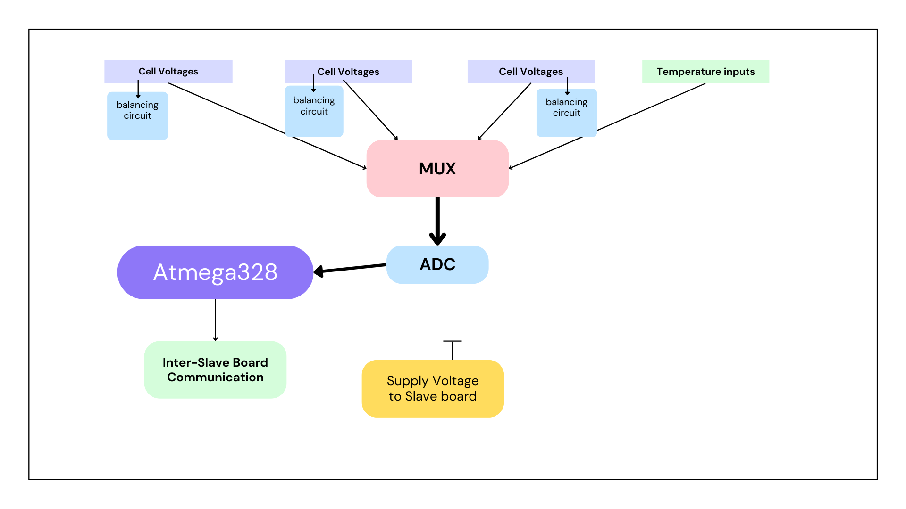

# Battery Management System (BMS) for Formula Student Vehicle

## Overview

This repository includes the design and implementation of a Battery Management System (BMS) tailored for Formula Student vehicles. The design is modular and supports voltage ratings of up to 1000V. The BMS is distributed across multiple boards, enabling flexible scaling based on the vehicle’s requirements.

In our implementation, we utilized 4 boards, each capable of handling 21 cells, with 7 additional analog pins for temperature sensing. These analog pins can also be reconfigured for general-purpose input. This system is adaptable for various voltage levels and configurations, making it ideal for motorsport applications.

## Key Features

- **Modular Design**: Easily adaptable to different voltage and cell configurations.
- **High Voltage Support**: Capable of measuring up to 1000V.
- **Distributed System**: Multiple boards for scalability and flexibility.
- **Low and High Voltage Isolation**: Built-in isolation between low and high voltage systems for safety.
- **Temperature Sensing**: Supports up to 84 temperature sensors in each Slave board.
- **I2C-based Isolated Communication**: Inter-board communication via an I2C bus with isolation for robustness and safety.

## System Architecture

The BMS was designed with low cost and ease of implementation in mind. To achieve this, the system is built around the **ATmega328** microcontroller (commonly found in Arduino Nano boards). The entire system is distributed across multiple boards:

- In our 350V system, we used 4 slave boards and 1 master board. 
- The master board is responsible for configuring, controlling, and collecting data from the slave boards.
- Current sensing is achieved using a shunt sensor, while voltage measurement is handled using precision voltage dividers.

### Components of Each Slave Board

Each slave board consists of the following key parts:

1. **Voltage Sensing Module**: Measures the voltage of individual cells using high-precision voltage dividers.
2. **Temperature Sensing**: Capable of handling multiple temperature inputs, configurable up to 21 cells with 7 additional analog inputs per board.
3. **Main Compute Unit**: Based on the ATmega328 microcontroller, it manages the sensing and communication tasks.
4. **Balancing Circuit**: Ensures cell balancing during charging and discharging cycles.
5. **Isolated Communication**: Facilitates safe communication between boards using isolated I2C buses.
6. **Error Detection and Communication**: Generates and communicates error states to the low-voltage system to ensure safety.

### Voltage Sensing

The voltage sensing module utilizes precision voltage dividers for accurate cell voltage measurement. To ensure ultra-precise voltage division, **potentiometers** are employed in the divider circuits.

Given the limited number of input channels on the microcontroller, we use a **16-to-1 multiplexer** to handle multiple voltage inputs. This reduces the number of required ADC inputs while ensuring that the measurement delay remains minimal. Only one of the microcontroller’s four available ADC channels is used for this purpose, further optimizing the design.

We incorporated a **24-bit ADC** for high-accuracy voltage measurements. The ADC communicates with the microcontroller using the **SPI protocol** for reliable and fast data transfer.

### Temperature Sensing

Temperature sensing is implemented intelligently to optimize the data collected from each cell module. In our configuration, we obtain the **maximum temperature** from each module in the system, ultimately acquiring 7 maximum values from the 84 total sensors across the system.

Each module consists of **8 cells in parallel**, and for each module, we use **3 temperature sensors**. The BMS compares the readings from these 3 sensors and outputs the **maximum temperature** value for each module. This ensures we monitor the most critical thermal points within the battery pack.

### Cell Balancing

We have implemented **passive cell balancing** to ensure consistent charging and discharging across all cells. The system initiates balancing when any cell reaches **4.1V**, at which point the BMS begins discharging the cell through a resistor. This prevents overcharging and maintains the health of the battery pack.

### Testing

The BMS was integrated into our Formula Student Electric vehicle (code-named **FERN**) and underwent extensive testing prior to competition. During testing, the BMS was configured to monitor and control cell voltages, temperatures, and balancing operations. The system performed well in these real-world conditions.

### Things to Improve

Through our testing and usage in competitive environments, a few areas for improvement were identified:

1. **Current Sensing Drift**: There is a slight drift in the current measurements during high discharge cycles, which could be refined.
2. **FPGA Implementation**: Implementing the system with an FPGA could improve performance by shrinking the design and increasing precision, but this would come at a higher cost.
3. **Off-the-shelf measurement ICs**: Some of Companies already have measurement ICs (like ADI and TEXAS Instruments) this was not feasible in our case, due to factory Lead times and Higher Costs.
4. **Voltage Sensing Accuracy**: Voltage sensing is slightly susceptible to errors during high discharge, likely due to noise or small fluctuations in the voltage divider circuits.

## Conclusion

This project presents a cost-effective, modular, and scalable Battery Management System (BMS) tailored for high-performance Formula Student electric vehicles. The system has proven its reliability through rigorous testing, but there are areas for further improvement, such as enhancing current sensing accuracy and exploring more compact design options through FPGA integration.

---

## License

This project is licensed under the MIT License - see the [LICENSE](LICENSE) file for details.

